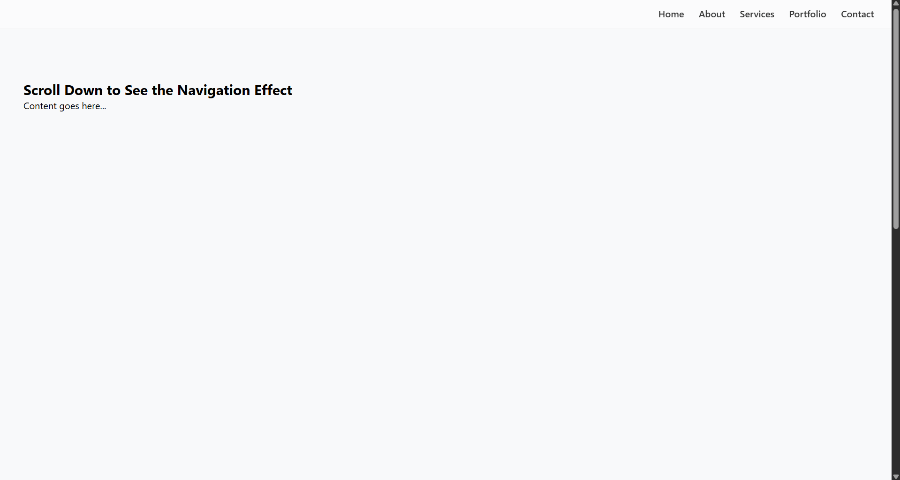

# Responsive Landing Page 🚀

A clean, modern, and fully responsive landing page designed to work flawlessly across all devices. Ideal for personal portfolios, startups, or product launches.

## 📸 Preview

 *(Screenshot on Landing page)*

## ✨ Features

- ✅ Mobile-first responsive design  
- ✅ Clean and modern UI  
- ✅ Fast loading and lightweight  
- ✅ HTML5, CSS3, and JavaScript (no frameworks)  
- ✅ Easy to customize and deploy  

## 🛠️ Tech Stack

- HTML5  
- CSS3  
- JavaScript (Vanilla)


## 🚀 Getting Started

1. Clone the repo:
   ```bash
   git clone https://github.com/your-username/responsive-landing-page.git
2. Open index.html in your browser

3. Customize as needed
